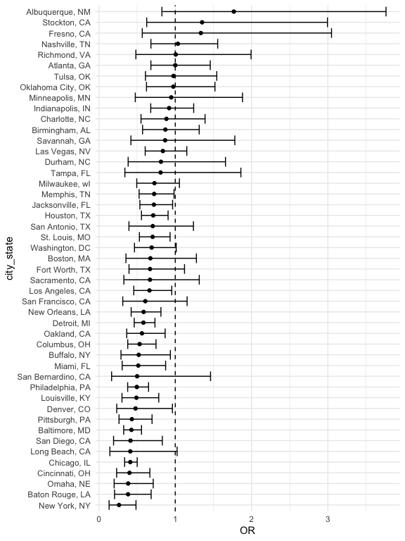

p8105_hw6_xc2784
================
2025-12-03

### Problem 1

``` r
raw = read_csv("https://raw.githubusercontent.com/washingtonpost/data-homicides/master/homicide-data.csv")
```

``` r
homicides <- raw %>%
  mutate(
    city_state = str_c(city, ", ", state),
    solved = as.numeric(disposition == "Closed by arrest"),
    victim_age = as.numeric(victim_age),
    victim_sex  = fct_relevel(victim_sex, "Female"),
    victim_race = fct_relevel(victim_race, "White")) %>% 
  filter(
    !(city == "Dallas" & state == "TX"),
    !(city == "Phoenix" & state == "AZ"),
    !(city == "Kansas City" & state == "MO"),
    !(city == "Tulsa" & state == "AL"),
    (victim_race %in% c("White", "Black")) 
  ) %>% 
    drop_na(
    solved,
    victim_age,
    victim_sex,
    victim_race
  )
```

``` r
baltimore <- homicides %>%
  filter(city_state == "Baltimore, MD")

baltimore_lr <- glm(
  solved ~ victim_age + victim_sex + victim_race,
  data = baltimore,
  family = binomial
)

baltimore_or <- tidy(baltimore_lr, conf.int = TRUE, exponentiate = TRUE) %>%
 mutate(OR = estimate)%>%
  select(term, OR, conf.low, conf.high)

baltimore_or
```

    ## # A tibble: 4 × 4
    ##   term                OR conf.low conf.high
    ##   <chr>            <dbl>    <dbl>     <dbl>
    ## 1 (Intercept)      3.16     2.00      5.06 
    ## 2 victim_age       0.993    0.987     1.000
    ## 3 victim_sexMale   0.426    0.324     0.558
    ## 4 victim_raceBlack 0.431    0.305     0.606

In Baltimore, male victims’ homicide cases are 57% less likely to be
resolved than those of female victims (adjusted OR = 0.43; 95% CI:
0.32–0.58), controlling for age and race.

``` r
library(purrr)

city_or <- homicides %>%
  group_by(city_state) %>%
  nest() %>%
  mutate(
    model = map(data, ~ glm(
      solved ~ victim_age + victim_sex + victim_race,
      data = .x, family = binomial
    )),
    results = map(model, ~ tidy(.x, conf.int = TRUE, exponentiate = TRUE))
  ) %>%
  unnest(results) %>%
  filter(term == "victim_sexMale")  %>% 
  mutate(OR = estimate)%>%
  select(city_state, OR, conf.low, conf.high)
  

city_or
```

    ## # A tibble: 47 × 4
    ## # Groups:   city_state [47]
    ##    city_state         OR conf.low conf.high
    ##    <chr>           <dbl>    <dbl>     <dbl>
    ##  1 Albuquerque, NM 1.77     0.825     3.76 
    ##  2 Atlanta, GA     1.00     0.680     1.46 
    ##  3 Baltimore, MD   0.426    0.324     0.558
    ##  4 Baton Rouge, LA 0.381    0.204     0.684
    ##  5 Birmingham, AL  0.870    0.571     1.31 
    ##  6 Boston, MA      0.674    0.353     1.28 
    ##  7 Buffalo, NY     0.521    0.288     0.936
    ##  8 Charlotte, NC   0.884    0.551     1.39 
    ##  9 Chicago, IL     0.410    0.336     0.501
    ## 10 Cincinnati, OH  0.400    0.231     0.667
    ## # ℹ 37 more rows

``` r
library(ggplot2)

city_ordered <- city_or %>%
  ungroup() %>% 
  arrange(OR) %>% 
  mutate(city_state = factor(city_state,levels = city_state))


city_plot <- ggplot(city_ordered, aes(x = OR, y = city_state)) +
  geom_point() +
  geom_errorbarh(aes(xmin = conf.low, xmax = conf.high)) +
  geom_vline(xintercept = 1, linetype = "dashed") +
  theme_minimal()

city_plot
```

<!-- -->

Most cities have ORs below 1, suggesting that homicides involving male
victims tend to be solved at lower rates than those involving female
victims once age and race are accounted for. A few cities, such as
Albuquerque, Stockton, and Fresno, show ORs above 1, indicating the
opposite pattern, but these are exceptions. However, most cities have
ORs near 1, and their confidence intervals cross 1, suggesting there is
little evidence of a statistically difference in resolved rates between
male and female victims after adjusting for age and race.
