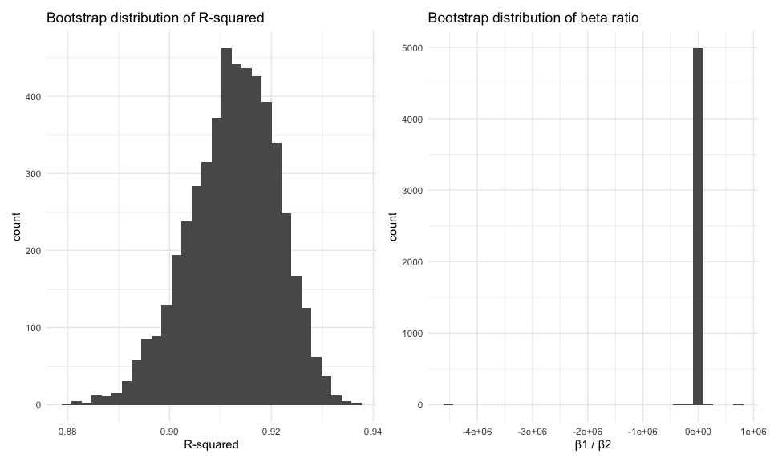

p8105_hw6_xc2784
================
2025-12-03

### Problem 1

``` r
raw = read_csv("https://raw.githubusercontent.com/washingtonpost/data-homicides/master/homicide-data.csv")
```

``` r
homicides <- raw %>%
  mutate(
    city_state = str_c(city, ", ", state),
    solved = as.numeric(disposition == "Closed by arrest"),
    victim_age = as.numeric(victim_age),
    victim_sex  = fct_relevel(victim_sex, "Female"),
    victim_race = fct_relevel(victim_race, "White")) %>% 
  filter(
    !(city == "Dallas" & state == "TX"),
    !(city == "Phoenix" & state == "AZ"),
    !(city == "Kansas City" & state == "MO"),
    !(city == "Tulsa" & state == "AL"),
    (victim_race %in% c("White", "Black")) 
  ) %>% 
    drop_na(
    solved,
    victim_age,
    victim_sex,
    victim_race
  )
```

``` r
baltimore <- homicides %>%
  filter(city_state == "Baltimore, MD")

baltimore_lr <- glm(
  solved ~ victim_age + victim_sex + victim_race,
  data = baltimore,
  family = binomial
)

baltimore_or <- tidy(baltimore_lr, conf.int = TRUE, exponentiate = TRUE) %>%
 mutate(OR = estimate)%>%
  select(term, OR, conf.low, conf.high)

baltimore_or
```

    ## # A tibble: 4 × 4
    ##   term                OR conf.low conf.high
    ##   <chr>            <dbl>    <dbl>     <dbl>
    ## 1 (Intercept)      3.16     2.00      5.06 
    ## 2 victim_age       0.993    0.987     1.000
    ## 3 victim_sexMale   0.426    0.324     0.558
    ## 4 victim_raceBlack 0.431    0.305     0.606

In Baltimore, male victims’ homicide cases are 57% less likely to be
resolved than those of female victims (adjusted OR = 0.43; 95% CI:
0.32–0.58), controlling for age and race.

``` r
library(purrr)

city_or <- homicides %>%
  group_by(city_state) %>%
  nest() %>%
  mutate(
    model = map(data, ~ glm(
      solved ~ victim_age + victim_sex + victim_race,
      data = .x, family = binomial
    )),
    results = map(model, ~ tidy(.x, conf.int = TRUE, exponentiate = TRUE))
  ) %>%
  unnest(results) %>%
  filter(term == "victim_sexMale")  %>% 
  mutate(OR = estimate)%>%
  select(city_state, OR, conf.low, conf.high)
  

city_or
```

    ## # A tibble: 47 × 4
    ## # Groups:   city_state [47]
    ##    city_state         OR conf.low conf.high
    ##    <chr>           <dbl>    <dbl>     <dbl>
    ##  1 Albuquerque, NM 1.77     0.825     3.76 
    ##  2 Atlanta, GA     1.00     0.680     1.46 
    ##  3 Baltimore, MD   0.426    0.324     0.558
    ##  4 Baton Rouge, LA 0.381    0.204     0.684
    ##  5 Birmingham, AL  0.870    0.571     1.31 
    ##  6 Boston, MA      0.674    0.353     1.28 
    ##  7 Buffalo, NY     0.521    0.288     0.936
    ##  8 Charlotte, NC   0.884    0.551     1.39 
    ##  9 Chicago, IL     0.410    0.336     0.501
    ## 10 Cincinnati, OH  0.400    0.231     0.667
    ## # ℹ 37 more rows

``` r
library(ggplot2)

city_ordered <- city_or %>%
  ungroup() %>% 
  arrange(OR) %>% 
  mutate(city_state = factor(city_state,levels = city_state))


city_plot <- ggplot(city_ordered, aes(x = OR, y = city_state)) +
  geom_point() +
  geom_errorbarh(aes(xmin = conf.low, xmax = conf.high)) +
  geom_vline(xintercept = 1, linetype = "dashed") +
    labs(
      x = "Adjusted OR (Male vs Female Victims)",
      y = "City, State",
      title = "Adjusted Odds Ratios for Resolved Homicides by City"
    ) +
  theme_minimal()

city_plot
```

<!-- -->

Most cities have ORs below 1, suggesting that homicides involving male
victims tend to be solved at lower rates than those involving female
victims once age and race are accounted for. A few cities, such as
Albuquerque, Stockton, and Fresno, show ORs above 1, indicating the
opposite pattern, but these are exceptions. However, most cities have
ORs near 1, and their confidence intervals cross 1, suggesting there is
little evidence of a statistically difference in resolved rates between
male and female victims after adjusting for age and race.

### Problem 2

``` r
library(p8105.datasets)
data("weather_df")

weather <-
  weather_df %>% 
  filter(name == "CentralPark_NY") %>% 
  drop_na(tmax, tmin, prcp)

reg = lm(tmax ~ tmin + prcp, data = weather)
reg %>% glance() %>% select(r.squared)
```

    ## # A tibble: 1 × 1
    ##   r.squared
    ##       <dbl>
    ## 1     0.912

``` r
reg %>% tidy()
```

    ## # A tibble: 3 × 5
    ##   term        estimate std.error statistic   p.value
    ##   <chr>          <dbl>     <dbl>     <dbl>     <dbl>
    ## 1 (Intercept)  7.56     0.162        46.6  1.31e-220
    ## 2 tmin         1.03     0.0119       86.9  0        
    ## 3 prcp        -0.00157  0.000966     -1.63 1.04e-  1

``` r
set.seed(1)
n_boot <- 5000

boot_samples <-
  weather %>%
  modelr::bootstrap(n = n_boot, id = "strap_id")

boot_results <-
  boot_samples %>%
  mutate(
    fit  = map(strap, ~ lm(tmax ~ tmin + prcp, data = .x)),
    gl   = map(fit, glance),
    coef = map(fit, tidy)
  ) %>%
  mutate(
    r_sq = map_dbl(gl, "r.squared"),
    beta_ratio = map_dbl(
      coef,
      ~ {
        tmp <- .x %>% select(term, estimate)
        
        b_tmin <- tmp %>%
          filter(term == "tmin") %>%
          pull(estimate)
        
        b_prcp <- tmp %>%
          filter(term == "prcp") %>%
          pull(estimate)
        
        b_tmin / b_prcp
      }
    )
  ) %>%
  select(strap_id, r_sq, beta_ratio)

boot_results
```

    ## # A tibble: 5,000 × 3
    ##    strap_id  r_sq beta_ratio
    ##    <chr>    <dbl>      <dbl>
    ##  1 0001     0.913      -237.
    ##  2 0002     0.921      -424.
    ##  3 0003     0.905     -1492.
    ##  4 0004     0.921      -364.
    ##  5 0005     0.906      -461.
    ##  6 0006     0.915      -634.
    ##  7 0007     0.919      -808.
    ##  8 0008     0.905     -2435.
    ##  9 0009     0.917      -723.
    ## 10 0010     0.916      -344.
    ## # ℹ 4,990 more rows

``` r
p1 = boot_results %>%
  ggplot(aes(x = r_sq)) +
  geom_histogram() +
  theme_minimal() +
  labs(x = "R-squared", title = "Bootstrap distribution of R-squared")

p2 = boot_results %>%
  ggplot(aes(x = beta_ratio)) +
  geom_histogram() +
  theme_minimal() +
  labs(x = "β1 / β2",
       title = "Bootstrap distribution of beta ratio")

p1+p2
```

<!-- -->

``` r
boot_results %>%
  summarize(
    r2_025  = quantile(r_sq, 0.025),
    r2_975  = quantile(r_sq, 0.975),
    br_025  = quantile(beta_ratio, 0.025),
    br_974  = quantile(beta_ratio, 0.975)
  )
```

    ## # A tibble: 1 × 4
    ##   r2_025 r2_975 br_025 br_974
    ##    <dbl>  <dbl>  <dbl>  <dbl>
    ## 1  0.894  0.928 -5616.  4587.

From the bootstrap results: r2: 95% CI: \[0.89, 0.93\] 𝛽1/𝛽2: 95% CI:
\[–5616.45, 4568.92\]

The bootstrap distribution of r2 is more concentrated and normally
distributed, with most values falling around 0.91–0.93. This suggests
that the fitted model gives similar r2 values across bootstrap samples.

The bootstrap distribution of the beta ratio 𝛽1/𝛽2 is much more spread
out, with values covering a very wide range and a tall spike near zero.
This indicates that the ratio varies a lot from sample to sample, and
its values can become quite large in magnitude. This happens because the
coefficient for precipitation is close to zero and flips sign across
samples
